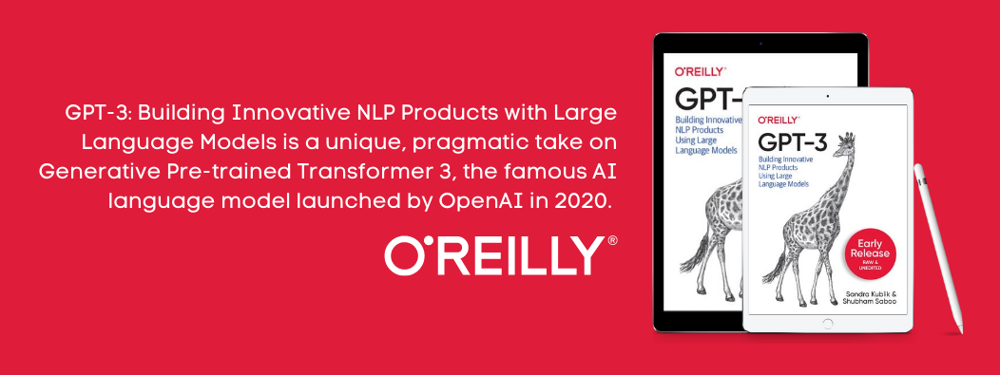

<h1> Hi there, I'm Shubham 👋 </h1>

<h2> About Me </h2>

- 📚 Co-author of _**["GPT-3: Building innovative NLP Products using Large Language Models"](https://www.amazon.com/GPT-3-Building-Innovative-Products-Language/dp/1098113624/ref=sr_1_12?crid=1X2IQ2BDCJ6Y7&keywords=gpt3&qid=1649507805&sprefix=%2Caps%2C777&sr=8-12)**_ by O'Reilly Media Publication.

- 🚀 Senior AI Evangelist at **[Jina AI](https://github.com/jina-ai/jina)**, an opensource ecosystem of products that enables building multi-modal and corss-modal applications on the cloud.

- 🔭 Building **[Kairos Data labs](https://www.linkedin.com/company/kairos-data-labs)** to reduce the friction between ideas and execution within organizations.

- 🌱 I’m looking to collaborate on building Open Source communities, organizing meetups and knowledge sharing sessions in the area of NLP, LLM, GPT-3 and the evolution of Nocode.

- 💬 Talk to me about **_GPT-3_**, **_Nocode_** and all things **_Open Source_**! 

<h2> Connect with me 🤝 </h2>

<strong>

🐦 [Twitter](http://www.twitter.com/Saboo_Shubham_) • 💼 [LinkedIn](https://www.linkedin.com/in/shubhamsaboo/) • 🖋️ [Medium](https://shubhamsaboo111.medium.com/) •  📺 [YouTube](https://www.youtube.com/channel/UCWRXc4CeXy5f0dQdJ2XWliw)

</strong>

<h2> My Blog Posts </h2>

<!-- BLOG-POST-LIST:START -->
- [Multimodal and Crossmodal applications: The new way to interact!](https://medium.com/jina-ai/multimodal-and-crossmodal-applications-the-new-way-to-interact-d73d3e932990)
- [DagsHub → Github for Data Science](https://pub.towardsai.net/dagshub-github-for-data-science-92e77adbc9a3?source=rss-5a7cdb63bae------2)
- [Advancing Neural Search with Jina 2.0](https://pub.towardsai.net/advancing-neural-search-with-jina-2-0-bb9c12c574c0?source=rss-5a7cdb63bae------2)
- [GPT-3: A Data Scientist in the Making](https://pub.towardsai.net/gpt-3-a-data-scientist-in-making-4e6fe4abe0c4?source=rss-5a7cdb63bae------2)
- [Prompt Engineering: The Career of Future](https://medium.com/nerd-for-tech/prompt-engineering-the-career-of-future-2fb93f90f117?source=rss-5a7cdb63bae------2)
<!-- BLOG-POST-LIST:END -->

